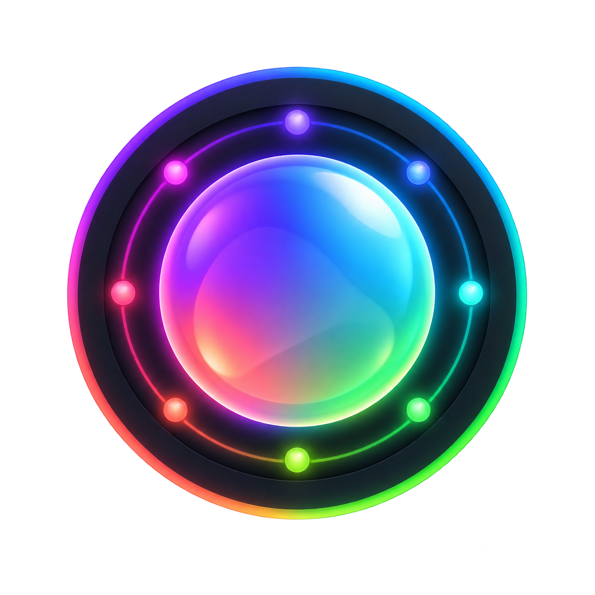

<p align="center">
  
</p>

# HiLight Studio

**Take full control of the HiLight light on your Pixel 11 Pro / Pro XL / Pro Fold.**

Your phone already uses that little RGB array next to the camera for a couple of things — a
colour for favourite callers, a glow while Gemini is listening. HiLight Studio unlocks the rest of
it: any colour, animated patterns, a different look per app, and colours that light up only when
you actually get a notification.

<p align="center">
  
</p>

> **Who this is for.** Pixel 11 Pro, Pro XL, or Pro Fold owners on Android 17 who don't mind
> running a one-time setup command. It doesn't unlock, root, or bypass anything on your phone — it
> just uses a permission your phone already grants to plain USB debugging / Shizuku, the same way a
> lot of "advanced" Android tools do.

---

## What you can do with it

| | |
|---|---|
| 🎨 **Any colour, any pattern** | Solid, breathing, blinking, pulsing, a chase, a comet, a travelling wave, a full rainbow, random colours, or set each of the 8 LEDs individually. |
| 📱 **A different look per app** | WhatsApp pulses green, Chrome glows blue while it's open, a keyword in a notification triggers its own colour — you decide, per app. |
| 🔔 **Notification vs. always-on** | Set one look that's always on, and let notifications briefly override it with their own colour before returning. |
| 🎭 **Presets** | Save a look you like, switch between saved looks with one tap, and export/import them to share with someone else running HiLight. |
| 🖼️ **Match your wallpaper** | One tap pulls the colours straight from your current wallpaper theme. |
| ⚙️ **Quick Settings tile** | Turn the whole thing on or off from the notification shade, without opening the app. |
| 🌙 **Quiet hours & battery-aware** | Define a window where it stays dark (or just dims). It pauses itself in Battery Saver, and below a battery level you choose. Also respects Do Not Disturb. |
| 🛡️ **Can't be left on by accident** | Built-in limits mean it always turns itself off after a short while — see [Safety](#safety), below. |

## Screenshots

<table>
<tr>
<td width="33%"></td>
<td width="33%"></td>
<td width="33%"></td>
</tr>
<tr>
<td align="center"><sub><b>Style</b> — pick a look</sub></td>
<td align="center"><sub><b>Apps</b> — per-app rules</sub></td>
<td align="center"><sub><b>Setup</b> — safety & access</sub></td>
</tr>
</table>

## Install

First, [download the latest experimental APK from GitHub Releases](https://github.com/DhananjayBhosale/hilight-studio/releases).
Open it on your supported Pixel, then allow installs from your browser or file manager if Android asks.

You'll then need one of two ways to give the app permission to control the light — this is a one-time
setup (repeated after each phone reboot). Pick whichever sounds easier.

### Option A — Shizuku (recommended, no computer after setup)

1. Install [Shizuku](https://shizuku.rikka.app/) from the Play Store.
2. Open Shizuku and start it via **Wireless debugging** (it walks you through pairing your phone
   with itself — no computer needed).
3. Install HiLight Studio and open it. On the **Setup** tab, tap **Request access** and allow it
   when Shizuku asks.

You'll need to start Shizuku again after every reboot, and reopen HiLight Studio afterwards. That's
a one-time, on-device, ~30-second routine — no cable required.

### Option B — ADB (one command from a computer)

1. Enable **USB debugging** on your phone (Settings → About phone → tap Build number 7 times →
   Developer options → USB debugging) and plug it into a computer.
2. Install HiLight Studio on the phone.
3. **Open HiLight Studio once** and leave it open. The app has to create the two files it uses to
   talk to the renderer, so starting the renderer first and never opening the app gets you nowhere.

4. Run **both** lines from your computer. The first clears any renderer already holding the LEDs;
   without it a leftover one keeps the array dark while everything still *reports* success.

   On **macOS**, **Linux**, or **PowerShell** — the single quotes on the second line matter, they let
   the phone resolve its own app path:

   ```bash
   adb shell "pkill -f 'com.hilight.(core.AdbHelper|studio:hilight)'"
   adb shell 'CLASSPATH=$(pm path com.hilight.studio | head -1 | cut -d: -f2) nohup app_process / com.hilight.core.AdbHelper > /data/local/tmp/hilight.log 2>&1 &'
   ```

   On **Windows Command Prompt**, which has no single quotes, the second line uses double ones:

   ```bat
   adb shell "pkill -f 'com.hilight.(core.AdbHelper|studio:hilight)'"
   adb shell "CLASSPATH=$(pm path com.hilight.studio | head -1 | cut -d: -f2) nohup app_process / com.hilight.core.AdbHelper > /data/local/tmp/hilight.log 2>&1 &"
   ```

   Command Prompt passes the pipe, parentheses, redirects, and `$()` through inside those double
   quotes. The phone—not Windows—therefore resolves the installed app path.

   The Setup tab has both pairs, each with its own copy button, so you never need to type them out.

5. Check that it started:

   ```bash
   adb shell cat /data/local/tmp/hilight.log
   ```

   You want `connected: 8 HiLight LEDs`. An **empty** log means the renderer never started — that is
   almost always the quoting, so try the other variant for your shell.

6. In the app, flip the **Live** switch on, then go to **Style** and pick a look. A new install
   starts with the always-on style set to *Off*, so the switch alone lights nothing.

Re-run both lines after every phone reboot.

### If the setup says it worked but the LEDs stay dark

Almost always a second renderer holding the array. Only one may drive it, and a leftover one keeps
pushing black — which wins, so the light stays off while the app still shows a connected renderer and
an open session. It happens if you ran the start line twice, or used Shizuku earlier (its renderer is
a daemon and outlives both Shizuku itself and this app being uninstalled).

Count them, and expect exactly one:

```bash
adb shell dumpsys lights | grep -c "Session token="
```

More than one? Run the reset line above, then the start line again. You can also check the live
colours the hardware is actually showing:

```bash
adb shell dumpsys lights
```

### After either option

In the Setup tab, grant **notification access** when you want notification rules, and **Usage access**
when you want a rule to run while an app is open. Then flip the **Live** switch. That's it.

## Safety

The LED array wasn't designed to stay on for long stretches, so HiLight Studio enforces limits that
you can't turn off from the UI:

- An always-on look **automatically switches off after 30 seconds** by default (you can raise this
  up to 5 minutes, with a couple of warnings along the way).
- Notification colours are capped even shorter, and cap out at 1 minute maximum.
- However bright you set it, brightness **eases down automatically** if it's stayed lit
  continuously for more than 10 seconds.
- It won't stay lit more than **half the time** over any 10-minute stretch — it rests the rest.

None of this needs configuring — it's just how the app behaves. When the array goes dark because of
one of these limits, the app tells you exactly why (not just "nothing is happening").

There are also two battery rules, both of which you *can* change in the Setup tab:

- it pauses while **Battery Saver** is on, at any level
- it pauses below **10%** — move the slider anywhere from 5% to 50%, or switch the rule off

Charging lifts the level rule, so a phone on the charger lights up whatever its percentage. If the
array is dark and you can't see why, the Live tab names the reason.

> **Want different limits?** HiLight Studio is open source. If you are comfortable building Android
> apps, you can download the project, change the timing and safety values in your own copy, and build
> your own APK.
>
> The version published here keeps the default limits because long, continuous use of the HiLight
> LEDs has not been tested. Use custom limits carefully — you are responsible for your own build.

## Requirements

- Pixel 11 Pro, Pro XL, or Pro Fold, on Android 17
- Shizuku, or a computer with `adb` for the one-time setup command

## Curious how it actually works?

The short version above is all you need to use it. If you want the low-level detail — how the app
gets permission to touch the LEDs without root, the exact hardware API, and what's been verified on
a real device — see [docs/TECHNICAL.md](docs/TECHNICAL.md).

## Contributing

Issues and pull requests are welcome. Please include the exact Pixel model, Android build, renderer
transport (Shizuku or ADB), and steps to reproduce for any hardware issue. Start with
[CONTRIBUTING.md](CONTRIBUTING.md) for the local checks and scope guidelines.

## Releasing

Official, signed APKs are published through [GitHub Releases](https://github.com/DhananjayBhosale/hilight-studio/releases).
The private signing key is never stored in this repository; maintainers should follow
[docs/RELEASING.md](docs/RELEASING.md).

See [CHANGELOG.md](CHANGELOG.md) for release-by-release changes.

## Security

Do not report a potential security issue in a public issue. See [SECURITY.md](SECURITY.md) for the
private reporting process.

## License

This project is licensed under the [MIT License](LICENSE). You may use, modify, redistribute, and
sell it; keeping the license text with redistributed copies is the only notice requirement.
