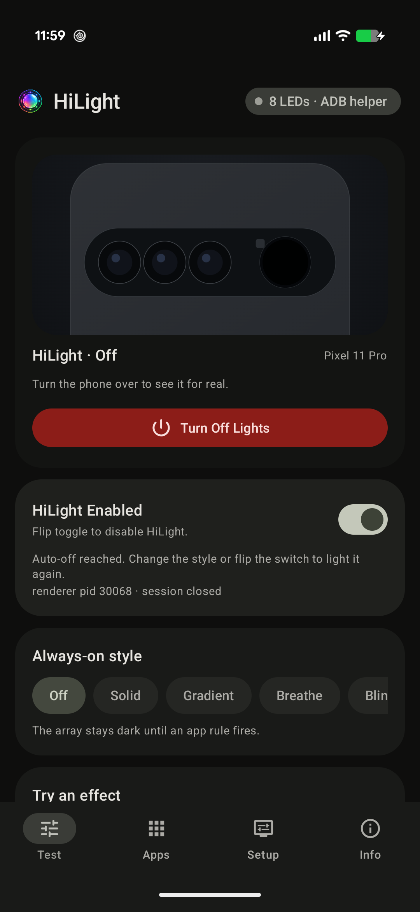
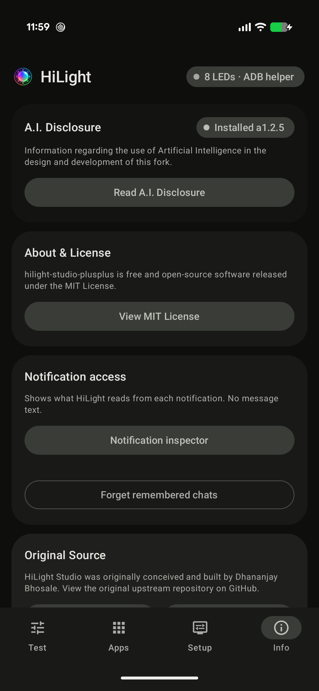

# Hilight-Studio-PlusPlusV3.5

**Version: `a1.2.5`** — Universal Hardware Lighting Control for Pixel 11 Pro, Pixel 11 Pro XL, and Pixel 11 Pro Fold devices on Android 17 (API 37).

[](CHANGELOG.md)
[](LICENSE)
[](CHANGELOG.md)

> [!WARNING]
> ### ⚖️ Non-Liability & Experimental A.I. Code Disclaimer
> This software contains experimental hardware lighting modifications and AI-assisted code for Google Pixel 11 Pro series devices. It is provided **"AS-IS"** under the MIT License without warranty of any kind, express or implied.
> - **Use at Your Own Discretion & Risk**: The developers, fork authors, contributors, and upstream creators assume **zero liability or responsibility** for any hardware damage (including LED burnout, thermal stress, or battery wear), data loss, software errors, security risks, or system instability resulting from the use of this application, ADB daemon scripts, or desktop utilities.
> - **User Acceptance**: By downloading, compiling, installing, or executing any part of this project, you acknowledge and agree that you assume all risks associated with its operation.

> [!NOTE]
> See [CHANGELOG.md](CHANGELOG.md) for the detailed log of custom additions, user requests, architectural enhancements, and privacy guarantees.

> [!IMPORTANT]
> **Hilight-Studio-PlusPlusV3.5** is an open-source enhancement supporting all devices across the **Pixel 11 Pro line** (Pixel 11 Pro, Pixel 11 Pro XL, and Pixel 11 Pro Fold) on Android 17 (API 37).

<p align="center">
  
</p>

## Features

- **Unified Clean UI (V3.5 Navigation)**:
  - **Test Tab**: Combines real-time effects preview, master switch, 12 signature presets/effects, 3-color pattern tuning, individual 8-LED customizations, Tabletop lighting tools (SOS Beacon, Video Fill Light, Fuel Gauge), and instant Notification Tests.
  - **Apps Tab**: Configure per-app notification colors, keyword triggers, and While-Open indefinite/custom-timer holds.
  - **Setup Tab**: Background status notification toggle, auto-off protection, Max Brightness Override, Session Priority slider, and Root / Shizuku / ADB access controls.
  - **Info Tab**: AI disclosures, MIT open source license, diagnostic peek inspector, and direct links to original creator and fork source repositories.
- **Enhanced "While Open" Controls**:
  - Optional **Stay Lit Indefinitely** toggle (with safety confirmation dialog) or customizable timer slider from 5 seconds up to **5 minutes**.
- **Max Brightness Override**:
  - 1-click header switch to bypass continuous dimming tapers and force 100% luminance across all 8 LEDs.
- **Material 3 Theming Engine**:
  - **Theme Modes**: System Follow, Light, Dark, and AMOLED Pitch Black (pure `#000000` power-saving mode for OLED and foldable screens).
  - **Material 3 Palettes**: Dynamic Material You (wallpaper colors), Pixel Indigo, Ocean Blue, Emerald Green, Coral Peach, Amber Gold, Berry Rose, and Monochrome.
- **Foldable Adaptive Dual-Pane Layout**:
  - Automatically switches between single-column navigation and dual-pane side `NavigationRail` with persistent real-time 8-LED `DeviceHero` when unfolded on the Pixel 11 Pro Fold inner screen (`>= 600dp`).
- **Tabletop Video Fill Light & Emergency SOS Beacon**:
  - Tuned continuous lighting for video calls, selfies, and tabletop shooting with color temperature presets: Warm (2700K), Soft (3800K), Neutral (4500K), and Cool (6500K).
  - High-visibility emergency SOS beacon.
- **8-LED Battery & Charging Fuel Gauge**:
  - Visual battery level indicator that lights LEDs proportionally (1–8) and breathes green when plugged in or charging.
- **Desktop GUI Control Manager (`HiLight-Control.exe`)**:
  - Native Windows desktop application with 3 one-click actions:
    1. *Full Easy Install & Flash*: Automatically installs/updates APK, launches the app, and starts the 8-LED renderer.
    2. *Start HiLight (Post-Reboot)*: Restarts the background ADB daemon in 1 click after phone reboot.
    3. *Stop / Kill ADB Session*: Cleanly terminates the background renderer and frees hardware lights control.
    4. *Live Device Status*: Real-time connection badge and integrated console log output.
- **Hardware & Lifecycle Safety Guards**:
  - Honors Android's "Pause app" and Digital Wellbeing timers, stopping background activity when suspended.
  - `START_NOT_STICKY` service behavior ensures clean force-stops via Android Settings without unwanted respawns.

## Screenshots

### 📱 Android Application (Pixel 11 Pro Series / Fold)

<table>
<tr>
<td width="25%"></td>
<td width="25%"></td>
<td width="25%"></td>
<td width="25%"></td>
</tr>
<tr>
<td align="center"><sub><b>1. Test &amp; Effects</b></sub></td>
<td align="center"><sub><b>2. Apps &amp; Triggers</b></sub></td>
<td align="center"><sub><b>3. Setup &amp; Safety</b></sub></td>
<td align="center"><sub><b>4. Info &amp; Disclosures</b></sub></td>
</tr>
</table>

### 🖥️ Windows Desktop Control Manager (`HiLight-Control.exe`)

<p align="center">
  
</p>

## 🖥️ Desktop Companion Suite (`HiLight-Control.exe`)

**`HiLight-Control.exe`** is a native Windows GUI controller designed to give users complete 1-click management of their Google Pixel 11 Pro series hardware lights without touching the command line:

- **🟢 Real-Time Hardware Detection**:
  - Live status badge displaying device connectivity, Pixel model name (Pixel 11 Pro, 11 Pro XL, or 11 Pro Fold), and USB/Wi-Fi hardware connection state.
- **⚡ 3 One-Click Action Cards**:
  1. **`🚀 1. Full Easy Install & Start`**: Instantly locates or compiles the latest APK, flashes/updates it on your connected Pixel, launches the app, and starts the rootless 8-LED renderer.
  2. **`⚡ 2. Start Hi-Light (After Phone Reboot)`**: Re-initializes the background ADB helper daemon in seconds after restarting your phone without needing to reinstall the APK.
  3. **`🛑 3. Stop / Kill ADB Session`**: Cleanly terminates the background process and turns off / releases hardware lights control.
- **🔒 Privacy-First ADB Detection**:
  - **Zero invasive directory scanning**: Automatically searches only standard developer environment variables (`ANDROID_HOME`, `ANDROID_SDK_ROOT`, standard SDK path, or local folder).
  - **Explicit User Consent**: If ADB is not found, provides an interactive opt-in dialog to download official Google platform-tools directly from `dl.google.com`, or select an existing `adb.exe` manually.
- **📐 High-DPI Adaptive Geometry & Resizable Windows**:
  - Built with dynamic `SizeType.AutoSize` architecture that looks crisp and legible on all monitor scaling factors (100%, 125%, 150%, 175%, 4K).
- **📝 Text Editor & Notepad Integration**:
  - Every informational dialog features **`📝 Open in Text Editor`** and **`📄 Open in Notepad`** buttons for instant viewing and editing.
- **📜 Live Output Console**:
  - Real-time scrolling terminal output stream with timestamped execution feedback and a 1-click **`🗑️ Clear Console`** action.

## Build & Install on Google Pixel 11 Pro Series

### 1. Build Your Private APK

To compile your own private build:

```bash
# On Windows PowerShell:
.\gradlew.bat assembleDebug

# On Linux/macOS:
./gradlew assembleDebug
```

The APK will be generated at: `app/build/outputs/apk/debug/app-debug.apk`.

### 2. Install / Flash to Pixel 11 Pro, Pixel 11 Pro XL, or Pixel 11 Pro Fold

Connect your **Pixel 11 Pro, Pixel 11 Pro XL, or Pixel 11 Pro Fold** via USB with **USB debugging** enabled in Developer Options:

```bash
adb install -r app/build/outputs/apk/debug/app-debug.apk
```

If replacing an earlier release signed with a different key:
```bash
adb uninstall com.hilight.studio
adb install -r app/build/outputs/apk/debug/app-debug.apk
```

Hilight-Studio-PlusPlus needs privileged access to the Android lights service. Choose one of the privilege methods below:

### Root

If the phone is rooted, open HiLight Studio and turn it on. The app detects root automatically and
uses it instead of Shizuku or ADB. Approve the one-time request from your root manager when it
appears; no other setup is needed.

### Shizuku

1. Install [Shizuku](https://shizuku.rikka.app/).
2. Start it using Wireless debugging.
3. Open HiLight Studio, go to **Setup**, tap **Request access**, and approve the request.

Restart Shizuku after each reboot, then reopen HiLight Studio.

### ADB

1. Enable **Developer options** and **USB debugging** on the phone.
2. Install and open HiLight Studio once so it can create its state files.
3. Run both commands below. The first stops any existing renderer. The second starts a fresh ADB helper.

macOS, Linux, or PowerShell (verified):

```bash
adb shell "pkill -f 'com.hilight.(core.AdbHelper|studio:hilight)'"
adb shell 'CLASSPATH=$(pm path com.hilight.studio | head -1 | cut -d: -f2) nohup app_process / com.hilight.core.AdbHelper > /data/local/tmp/hilight.log 2>&1 &'
```

Windows Command Prompt (Unverified):

```bat
adb shell "pkill -f 'com.hilight.(core.AdbHelper|studio:hilight)'"
adb shell "CLASSPATH=$(pm path com.hilight.studio | head -1 | cut -d: -f2) nohup app_process / com.hilight.core.AdbHelper > /data/local/tmp/hilight.log 2>&1 &"
```

Keep the two commands separate. The `pkill -f` pattern can match the shell that starts the helper if both operations are merged.

Check the helper log:

```bash
adb shell cat /data/local/tmp/hilight.log
```

A successful start reports `connected: 8 HiLight LEDs`.

## Safety limits

The renderer enforces these limits even if app state is edited:

- Ambient effects stop after 30 seconds by default and can be raised to 5 minutes.
- Notification effects are limited to 1 minute.
- Privacy activity rules run only while the microphone or camera remains active.
- Sustained brightness tapers after 10 seconds of continuous light (can be overridden via Max Brightness Override).
- The array can be active for at most half of any 10-minute window.
- Battery Saver, low-battery, quiet-hours, screen-state, and Do Not Disturb rules can pause output.

## Privacy

HiLight Studio has no analytics, account system, or telemetry. It operates entirely offline on your device. No app rules, notification data, or settings are ever transmitted over the network.
Notification and usage access are optional and are used strictly locally for the rules you enable. Privacy activity rules observe only whether Android reports the microphone or camera as active; HiLight never reads or records audio, video, or their contents.

Message text is never stored, never logged, and never included in anything the notification inspector copies or shares.

## License

This project is licensed under the MIT License — see the [LICENSE](LICENSE) file for details.
